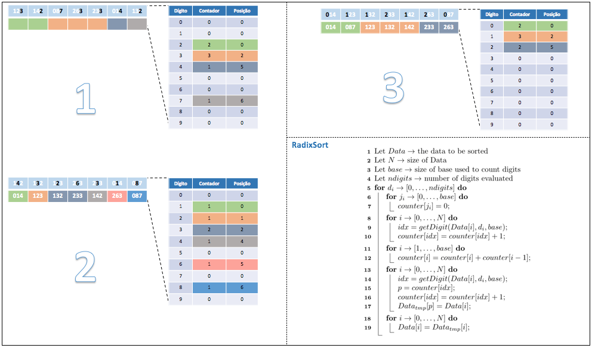

# Heap Sort: Implementação em C

 
 
 
 

 

 

Desenvolvido por Harold H. Seward no MIT em 1954, o Radix Sort é um método de ordenação que não utiliza comparações entre elementos para ordena-los. Seu modelo de execução foi pensado para ordenar o conjunto de entrada pela ordem lexicográfica, ou seja, ordem natural crescente ou decrescente dos dígitos que compõe cada elemento do conjunto. Nesse contexto, há dois modelos operacionais do algoritmo:

1. Least Significant Digit - LSD
2. Most Significant Digit - MSD

Embora pensando a princípio para ordenar cartões perfurados e posteriormente adotado para ordenar números inteiros, o Radix Sort não se limita a essas operações. Seu modelo operacional permite que quaisquer conjuntos possam ser colocados em ordem lexicográfica sem maiores modificações em seu modo de execução. A idéia por trás desse método é observar os elementos do conjunto a partir de seus dígitos, ordenando-os sucessivamente do menor para o maior ( LSD ) ou do maior para o menor dígito encontrado ( MSD ). Vejamos a seguir uma sequência de passos para ordenar o conjunto de entrada {123, 142, 087, 263, 233, 014, 132}, bem como, o pseudo algoritmo utilizado pelo Radix Sort. 

	 

 

Um simulador do Radix Sort com um conjunto maior de entradas pode ser observado [vide site](https://www.cs.usfca.edu/~galles/visualization/RadixSort.html). 

Note que, no modelo de pseudo algoritmo apresentado como parte da figura acima não há recursão e comparações entre elementos do conjunto. A ausência de recursão reduz a necessidade de espaço em memória, o que torna o Radix Sort uma boa opção para grandes conjuntos de dados. Além disso esse método de ordenação é considerado um método estável. Como desvantagens, tem-se a dificuldade, em alguns casos, de se otimizar a função getDigit e o método em questão não é considerado boa opção se o número de digitos é grande. 

> Quanto aos custos computacionais, podemos observar:
>
> - O custo para verificação dos dígitos é de 2 * N  * ndigits.
> - O custo para trocas é de N * ndigits
> - Se ndigits for pequeno e/ou constante, o método apresenta custo linear, ou seja, .

Em literatura é possível encontrar estudos apontando que o número máximo de dígitos tratados deve ser 10. Valores acima disso podem gerar depreciação na execução e tempo de resposta. Além disso, em termos gerais o custo total do Radix Sort para ordenar um conjunto de N elementos de entrada é apresentada como . 

# Compilação e Execução

O método Radix Sort disponibilizado possui um arquivo Makefile que realiza todo o procedimento de compilação e execução. Para tanto, temos as seguintes diretrizes de execução:

| Comando                |  Função                                                                                           |
| -----------------------| ------------------------------------------------------------------------------------------------- |
|  `make clean`          | Apaga a última compilação realizada contida na pasta build                                        |
|  `make`                | Executa a compilação do programa utilizando o gcc, e o resultado vai para a pasta build           |
|  `make run`            | Executa o programa da pasta build após a realização da compilação                                 |

# Contatos

<a style="color:black" href="mailto:michel@cefetmg.br?subject=[GitHub]%20Source%20Dynamic%20Lists">
✉️ <i>michel@cefetmg.br</i>
</a>